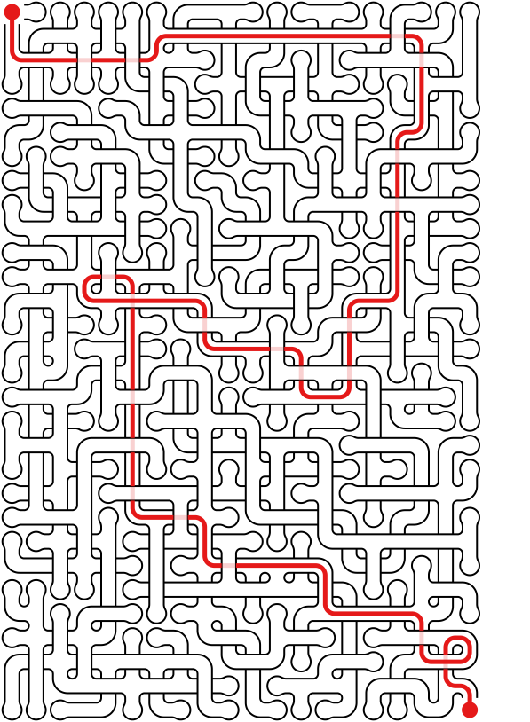
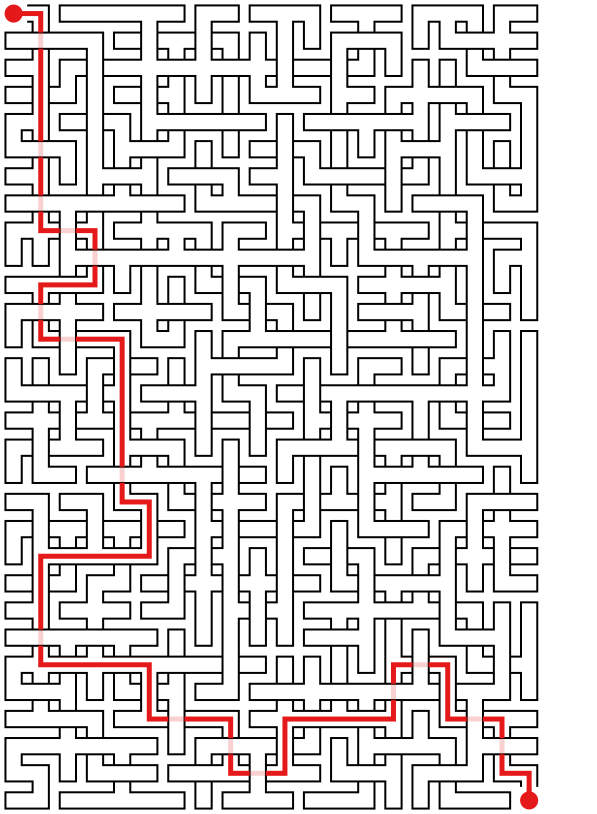

maze
====
[](http://pepy.tech/project/maze)

[Website](https://maze.do.id.au/?level=medium)

Maze generator with crossings.

Installation
```bash
pip3 install maze
```
Or install from source:
```bash
python3 setup.py install
```

To export a 20 by 30 maze SVG and a solution SVG, run:
```bash
maze svg maze.svg -s maze-solved.svg -W 20 -H 30
```
To using python3 directly, change into the directory with the file `maze.py` and run:
```bash
python3 maze.py svg maze.svg -s maze-solved.svg -W 20 -H 30
```
will produce:

| maze.svg          | maze-solved.svg            | 
|-------------------|----------------------------|
|  |  |

Using the `-S` option will produce a maze with no curves produces:

| maze.svg                   | maze-solved.svg                     |
|----------------------------|-------------------------------------|
|  |  |


To generate PDF (currenlty this options doesn't allow solutions to be generated)
```bash
maze pdf my_maze.pdf
```
will produce a pdf.

Run `maze` without any arguments to see all options.


