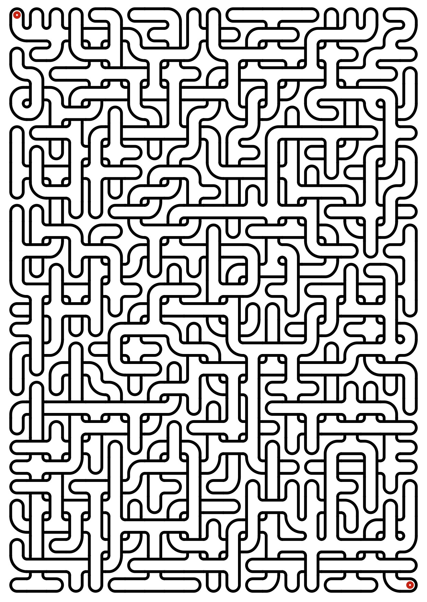

maze
====

Maze generator with crossing.

    python maze_pdf.py    

https://github.com/daleobrien/maze/blob/master/sample_maze.jpg

Will generate a maze much like this,

    python maze_ascii.py

    ┌─┐ ┌─┐ ┌─┐ ┌── ─── ──┐ ┌─┐ ┌─┐ ┌─┐ ┌─┐
    │ │ │ │ │ │ └── ─── ┐ │ │ │ │ │ │ │ │ │
    │ └ ┘ └ ┘ └ ─── ─── ┴─┴ ┘ └ ┘ └ ┤ ├ ┘ │
    │ ┌ ─── ─── ─── ─── ┬─┬ ┐ ┌ ┐ ┌ ┤ ├ ──┘
    │ │ ┌─┐ ┌─┐ ┌── ──┐ │ └ ┴─┴ ┘ │ │ │ ┌─┐
    └─┘ │ │ │ │ │ ┌ ┐ │ └── ┬─┬ ┐ │ │ │ │ │
    ┌── ┘ │ │ └ ┴─┴ ┘ │ ┌─┐ │ └ ┤ ├ ┘ │ │ │
    │ ┌ ──┘ │ ┌ ┬─┬ ──┘ │ │ └── ┤ ├ ┐ │ │ │
    │ │ ┌─┐ │ │ │ │ ┌── ┤ ├ ──┐ │ │ │ └ ┘ │
    │ │ │ │ └─┘ │ │ │ ┌ ┤ ├ ──┘ │ │ └── ┐ │
    │ └ ┴─┴ ─── ┴─┴ ┘ │ │ └ ─── ┴─┴ ──┐ │ │
    │ ┌ ┬─┬ ┐ ┌ ┬─┬ ┐ │ └── ┐ ┌ ┬─┬ ┐ │ └─┘
    │ └ ┘ └ ┤ ├ ┘ │ │ │ ┌── ┴─┴ ┘ └ ┤ ├ ──┐
    │ ┌ ─── ┤ ├ ┐ │ └─┘ │ ┌ ┬─┬ ─── ┤ ├ ──┘
    │ │ ┌─┐ │ └ ┴─┴ ─── ┤ ├ ┘ └ ──┐ │ └ ──┐
    └─┘ │ │ │ ┌ ┬─┬ ┐ ┌ ┤ ├ ┐ ┌ ──┘ │ ┌ ──┘
    ┌── ┤ ├ ┘ │ │ └ ┤ ├ ┘ └ ┤ ├ ─── ┴─┴ ──┐
    │ ┌ ┤ ├ ──┘ │ ┌ ┤ ├ ─── ┤ ├ ┐ ┌ ┬─┬ ──┘
    │ │ │ └ ─── ┘ │ │ │ ┌── ┘ │ │ │ │ └ ──┐
    └─┘ └── ─── ──┘ └─┘ └── ──┘ └─┘ └── ──┘

Requirements
===
For the maze_pdf.py, you will need to install reportlab.

    pip install reportlab
