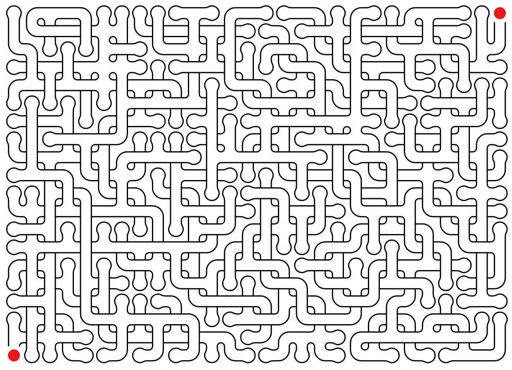
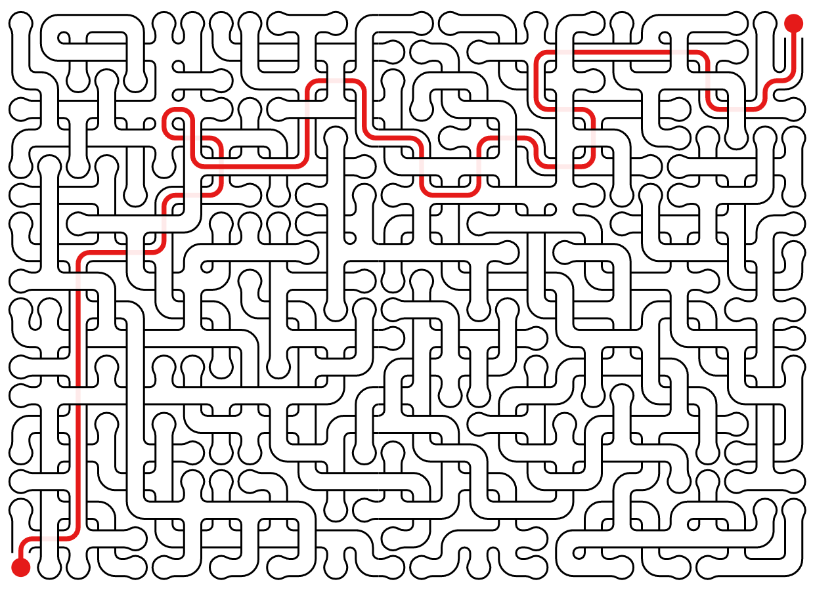

maze
====

[Website](https://maze.do.id.au/new?level=medium)

Maze generator with crossing;

    maze pdf my_maze.pdf    

will produce a pdf, much like this one by default;

And corresponding solution:

Run maze without any arguments to see all help and options.

Installation
===
    pip3 install maze

