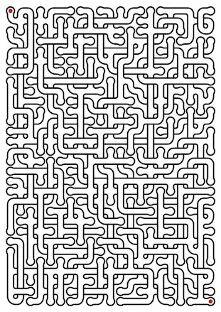

maze
====

Maze generator with crossing;

    maze pdf my_maze.pdf    

will produce a pdf, much like this one by default;

Run maze without any arguments to see all help and options.

Installation
===
    pip install maze

